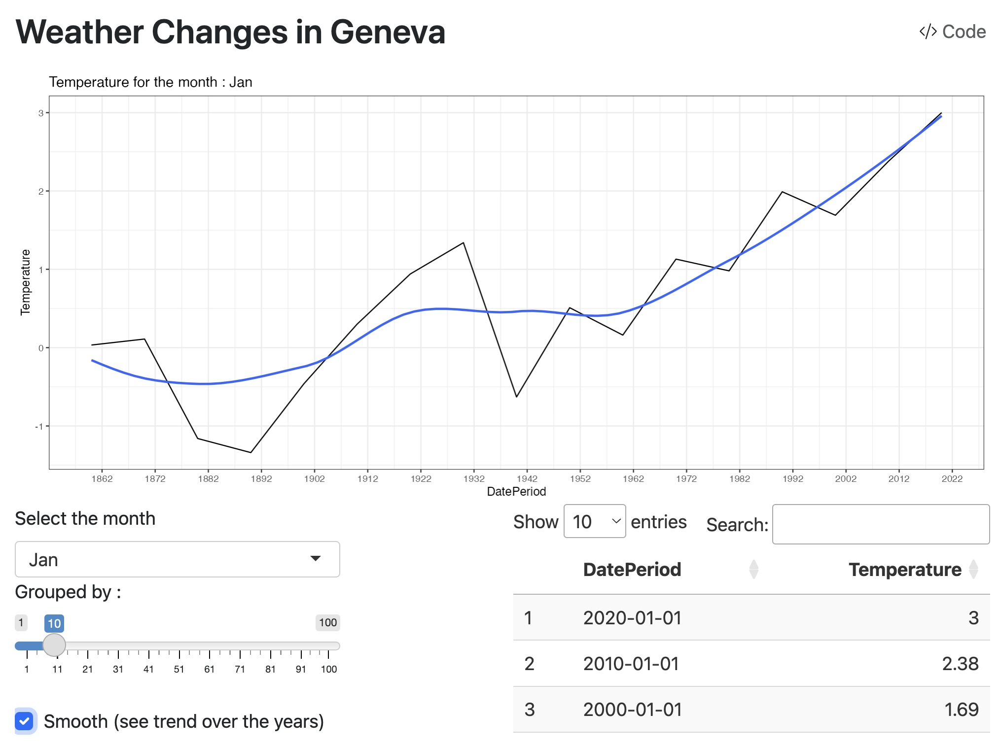

# Weather App for Geneva

## Description
A way to visualize weather from 1864 to the present day, grouped by month of the year, to better visualize the trends in change of temperature

## Preview

## Dependencies

This project relies on the following R packages:

- dplyr: for data manipulation
- shiny: to create easily an app to visualize data 
- lubridate: handling dates 
- plotly: creating interactive visual graphs

## How to run this app 

You can run this app by downloading the project and running the app.R file. 

 